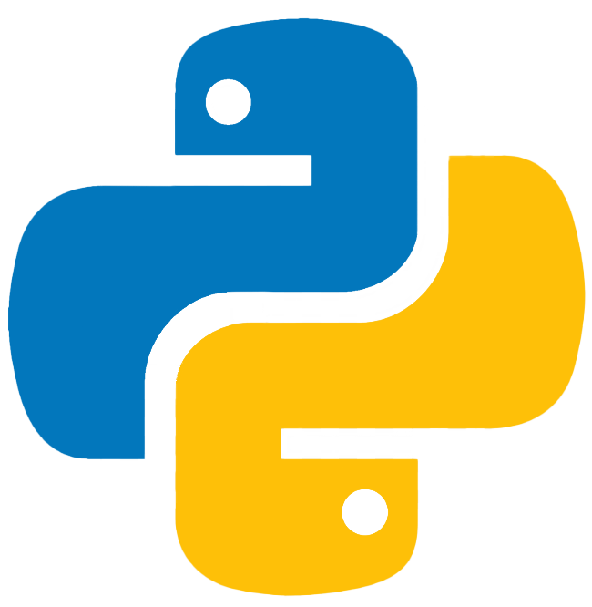

<a href="https://www.python.org/">

<h1 align="center"><a href="https://platzi.com/cursos/python-pip/">Python</a></h1>

  Este proyecto fue hecho en VS Code con Jupyter Notebooks. Por
    <a href="https://github.com/DensLopez">Dennis.</a>
  

 
<h1></h1>
 
<h1 align="center">Acerca de </h1>
Este repositorio está relacionado al lenguaje Python, desde fundamentos hasta temas específicos. Pretendo que sea una guía para el entendimiento del lenguaje, contiene archivos ["ipynb"](codes) con los códigos y apuntes desarrollados.
 

 

## Temario

### Fundamentos

- - [code001.ipynb](codes/code001.ipynb)
- - [code002.ipynb](codes/code002.ipynb)
- - [code003.ipynb](codes/code003.ipynb), [code003.html](codes/html/code003.html)
- - [code004.ipynb](codes/code004.ipynb), [code004.html](codes/html/code004.html)
- - [code005.ipynb](codes/code005.ipynb), [code005.html](codes/html/code005.html)
- - [code006.ipynb](codes/code006.ipynb), [code006.html](codes/html/code006.html)
- - [code007.ipynb](codes/code007.ipynb), [code007.html](codes/html/code007.html)
- - [code008.ipynb](codes/code008.ipynb), [code008.html](codes/html/code008.html)
- - [code009.ipynb](codes/code009.ipynb), [code009.html](codes/html/code009.html)
- - [code010.ipynb](codes/code010.ipynb), [code010.html](codes/html/code010.html)
- - [code011.ipynb](codes/code011.ipynb), [code011.html](codes/html/code011.html)
- - [code012.ipynb](codes/code012.ipynb), [code012.html](codes/html/code012.html)
- - [code013.ipynb](codes/code013.ipynb), [code013.html](codes/html/code013.html)
- - [code014.ipynb](codes/code014.ipynb), [code014.html](codes/html/code014.html)
- - [code015.ipynb](codes/code015.ipynb), [code015.html](codes/html/code015.html)
- - [code016.ipynb](codes/code016.ipynb), [code016.html](codes/html/code016.html)
- - [code017.ipynb](codes/code017.ipynb), [code017.html](codes/html/code017.html)
- - [code018.ipynb](codes/code018.ipynb), [code018.html](codes/html/code018.html)
- - [code019.ipynb](codes/code019.ipynb), [code019.html](codes/html/code019.html)
- - [code020.ipynb](codes/code020.ipynb), [code020.html](codes/html/code020.html)
- - [code021.ipynb](codes/code021.ipynb), [code021.html](codes/html/code021.html)
- - [code022.ipynb](codes/code022.ipynb), [code022.html](codes/html/code022.html)
- - [code023.ipynb](codes/code023.ipynb), [code023.html](codes/html/code023.html)
- - [code024.ipynb](codes/code024.ipynb), [code024.html](codes/html/code024.html)
- - [code025.ipynb](codes/code025.ipynb), [code025.html](codes/html/code025.html)
- - [code026.ipynb](codes/code026.ipynb), [code026.html](codes/html/code026.html)
- - [code027.ipynb](codes/code027.ipynb), [code027.html](codes/html/code027.html)
- - [code028.ipynb](codes/code028.ipynb), [code028.html](codes/html/code028.html)
- - [code029.ipynb](codes/code029.ipynb), [code029.html](codes/html/code029.html)
- - [code030.ipynb](codes/code030.ipynb), [code030.html](codes/html/code030.html)
- - [code031.ipynb](codes/code031.ipynb), [code031.html](codes/html/code031.html)
- - [code032.ipynb](codes/code032.ipynb), [code032.html](codes/html/code032.html)
- - [code033.ipynb](codes/code033.ipynb), [code033.html](codes/html/code033.html)
- - [code034.ipynb](codes/code034.ipynb), [code034.html](codes/html/code034.html)
- - [code035.ipynb](codes/code035.ipynb), [code035.html](codes/html/code035.html)
- - [code036.ipynb](codes/code036.ipynb), [code036.html](codes/html/code036.html)
- - [code037.ipynb](codes/code037.ipynb), [code037.html](codes/html/code037.html)
- - [code038.ipynb](codes/code038.ipynb), [code038.html](codes/html/code038.html)
- - [code039.ipynb](codes/code039.ipynb), [code039.html](codes/html/code039.html)
- - [code040.ipynb](codes/code040.ipynb), [code040.html](codes/html/code040.html)

 
